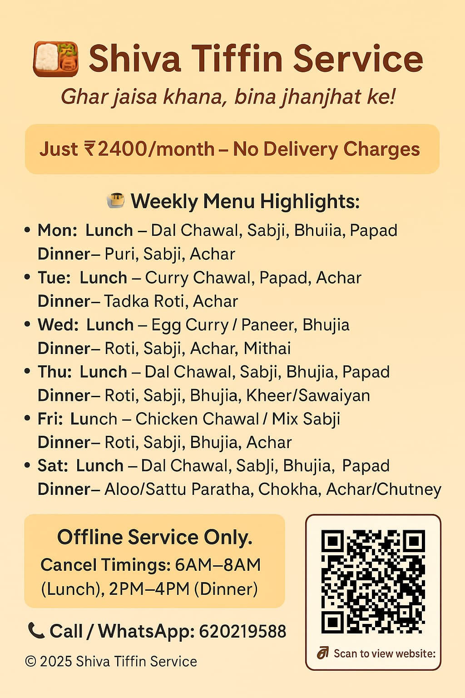

<!DOCTYPE html>
<html lang="en">
<head>
  <meta charset="UTF-8" />
  <meta name="viewport" content="width=device-width, initial-scale=1" />
  <title>Shiva Tiffin Service</title>
  
</head>
<body>

  <header>
    <h1>Shiva Tiffin Service 🍱</h1>
    
Healthy • Homely • Hygienic

  </header>

  <section class="box">
    <h2>📅 Weekly Menu</h2>
    
<strong>Monday:</strong>  Lunch – Dal, Chawal, Sabji, Bhujiya, Papad  Dinner – Puri, Sabji, Aachar

    
<strong>Tuesday:</strong>  Lunch – Curry, Chawal, Papad, Aachar  Dinner – Tadka, Roti, Aachar

    
<strong>Wednesday:</strong>  Lunch – Egg Curry / Paneer or Mix Sabji (Veg option)  Dinner – Roti, Sabji, Aachar, Bhujiya, Mithai

    
<strong>Thursday:</strong>  Lunch – Dal, Chawal, Sabji, Bhujiya, Papad  Dinner – Roti, Sabji, Bhujiya, Kheer / Sawaiyan

    
<strong>Friday:</strong>  Lunch – Chicken Chawal / Mix Sabji (Veg option)  Dinner – Roti, Sabji, Bhujiya, Aachar

    
<strong>Saturday:</strong>  Lunch – Dal, Chawal, Sabji, Bhujiya, Papad  Dinner – Aloo Paratha / Sattu Paratha, Chokha, Aachar / Chatni

    
<strong>Sunday:</strong>  Lunch – Egg or Chicken Chawal / Paneer (Veg option)  Dinner – Roti, Sabji, Bhujiya, Aachar, Mithai

  </section>

  <section class="box">/
    <h2>💰 Rates & Rules</h2>
    
🍛 Full Plate – ₹2400/month

    
🥗 Half Plate – ₹1800/month

    
🚚 <strong>Offline Service Only</strong> – No online orders

    
📦 <strong>No Delivery Charges</strong>

    
✅ <strong>No Charge</strong> if food not taken

    
🕒 <strong>Cancellation Time:</strong>

    <ul>
      <li>⏰ Morning food – Cancel between <strong>6 AM to 8 AM</strong></li>
      <li>🌙 Night food – Cancel between <strong>2 PM to 4 PM</strong></li>
    </ul>
  </section>

  <section class="box">
    <h2>🌟 Customer Ratings</h2>
    
⭐️⭐️⭐️⭐️☆

    
"Tastes like home. So satisfying!"

    
"Shiva Tiffin = Dumka’s best tiffin!"

  </section>

  <section class="box">
    <h2>📞 Contact Us</h2>
    
📱 <strong>Call / WhatsApp:</strong> <a href="tel:6202195788">6202195788</a>

    
📍 <strong>Location:</strong> Rasikpur, Muni Baba Kutiya, Dumka, Jharkhand

  </section>

  <a class="btn" href="tel:6202195788">📞 Call Now</a>
  <a class="btn whatsapp" href="https://wa.me/916202195788" target="_blank">💬 WhatsApp Us</a>
<section class="box">
  <h2>🖼️ View Our Flyer</h2>
  
  
<a href="flyer.png" download style="display:inline-block; margin-top:8px;">⬇️ Download Flyer</a>

</section>
  <footer>
    Website by Rishu 💖 
    Shiva Tiffin Service © 2025
  </footer>

</body>
</html>
